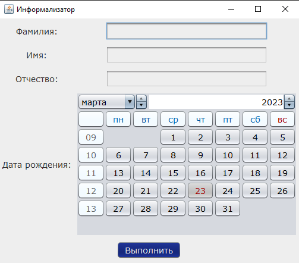
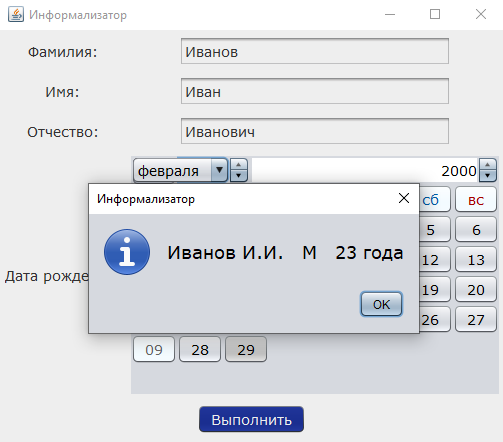

# Имплементация GUI-приложения, позволяющая получить персональную информацию по введенным данным
All methods and fields are documented according to the Javadoc standard.

## Контент

0. [Основное](#Основное)
1. [Примеры кода](#Примеры-кода)
2. [Изображения](#Изображения)

## Основное
____
- Human и App классы, поддерживающий операции:
    - Ввод данных и создание экземпляра класса
    - Получение результата на основании введенных данных
____
[:arrow_up:Headline](#Headline)

## Примеры кода
Конструктор с параметрами класса `Human`:
```Java
public class Human {

    public Human(String fullName, String birthDateString) throws DateTimeException {
        String[] nameParts = fullName.split(" ");
        this.lastName = nameParts[0];
        this.firstName = nameParts[1];
        this.middleName = nameParts[2];
        try {
            DateTimeFormatter formatter = DateTimeFormatter.ofPattern("dd.MM.yyyy");

            this.birthDate = LocalDate.parse(birthDateString, formatter);
        }
        catch (DateTimeException dex)
        {
            throw new DateTimeException("Actually, unknown trouble");
        }
    }
}
```
____
Методы класса `Human`:
```Java
public class FileWorking {

    public String getInitials() {
        return String.format("%s.%s.", firstName.charAt(0), middleName.charAt(0));
    }
    public String getGender() {
        if (middleName.endsWith("а") || middleName.endsWith("зы") ) {
            return "Ж"; // Female
        } else {
            return "М"; // Male
        }
    }
    public int getAge() {
        Period period = Period.between(birthDate, LocalDate.now());
        return period.getYears();
    }
    public String getAgeSuffix() {
        int age = getAge();
        if (age % 10 == 1 && age != 11) {
            return "год";
        } else if (age % 10 >= 2 && age % 10 <= 4 && !(age >= 12 && age <= 14)) {
            return "года";
        } else {
            return "лет";
        }
    }
    public boolean isValidBirthDate() {
        LocalDate now = LocalDate.now();
        return !birthDate.isAfter(now);
    }
}
```
____
Перегруженный метод строкового представления класса `Human`:
```Java
public class Human {

    @Override
    public String toString() throws DateTimeException {
        if (!isValidBirthDate()) {
            throw  new DateTimeException("Вы ввели дату из будущего, попробуйте еще раз ^_^");
        }
        return String.format("%s %s   %s   %d %s", lastName, getInitials(), getGender(), getAge(), getAgeSuffix());
    }
}
```
____
## Изображения
Here's what it looks like
----
Основное окно

----
Результат

----
Исключения

----